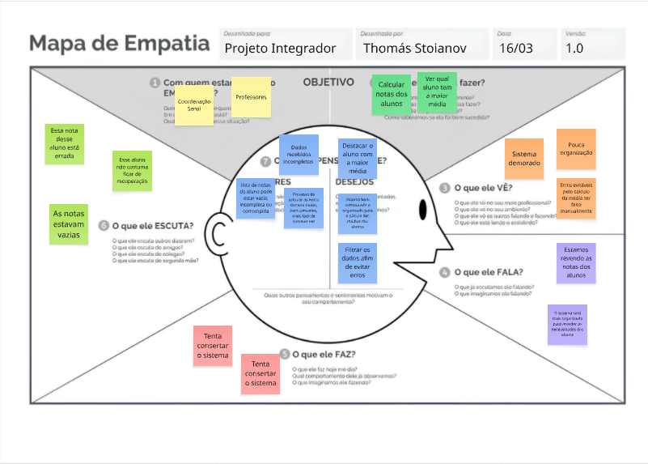

LEVANTAMENTO DE REQUISITOS

Aqui vemos o que o sistema deve conter, quais requisitos ele deve atender para que o objetivo final seja cumprido

Requisitos Funcionais:

O sistema deve calcular a média dos alunos.

O sistema deve verificar se a nota dos alunos está vazia ou com um dado incorreto
O sistema deve identificar o aluno com a maior média
O sistema deve identicar o aluno com maior média

Requisitos Não Funcionais:

O sistema deve ser rápido

O sistema deve ser seguro com os dados

O sistema deve ser organizado e bem estruturado
O sistema deve possuir código legível e bem estruturado
O sistema deve utilizar boas práticas de programação

O sistema deve possuir código legível e bem estruturado

O sistema deve utilizar boas práticas de programação

Regras de negócio:

Alunos que tiverem a média menor que 7.0 ficam de recuperação
Aluno com maior média recebe o título de Top Student
Apenas números podem ser considerados notas válidas
Alunos com notas vazias não devem ser considerados 

KANBAN

Nessa etapa discutimos o que estamos fazendo, para termos organização durante o processo 

